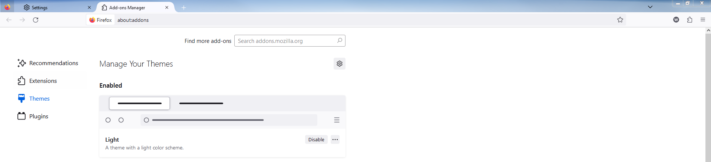

# Photon Australis
Bringing the old Australis UI back to Firefox

## Why?
I wanted to be able to use a more familiar UI for Firefox, so I branched this project off and made a few modifications.

## ⚠ Support note ⚠:
I will be updating this CSS for the latest version of Firefox and Firefox ESR, if you want to install it on older versions feel free to use [Wilfredwee's Version](https://github.com/wilfredwee/photon-australis)

Curently there is a working version for 118 and above in the [dev branch](https://github.com/Glitchcode2447/Firefox-Australis-Theme/tree/dev), feel free to add any issues that you find.

### How to Install:
1. In the Firefox URL bar, type `about:config`.
1. Set `toolkit.legacyUserProfileCustomizations.stylesheets` to `true`
1. Open your profile folder.
    1. Type `about:profiles` in your url bar.
    1. Under the profile that is in use (The message will say something like `This is the profile in use and it cannot be deleted.`), click `Open Folder` on the `Root Directory` row.
1. If that folder doesn't have a `chrome` folder, create one.
1. Download the `userChrome.css` file and place it in your `chrome` folder.
1. Restart Firefox and you're done.

## Something's Broken
Feel free to submit an issue and I'll try to fix it as soon as I can.

Although I'm probably already fixing the issue you're having, as this is the theme for my browser as well.

## Wilfredwee's FAQ 
### Nothing's changed for me
Make sure that your file extension for `userChrome.css` is correct. Most likely a problem for Windows, refer to [this issue](https://github.com/wilfredwee/photon-australis/issues/104).
